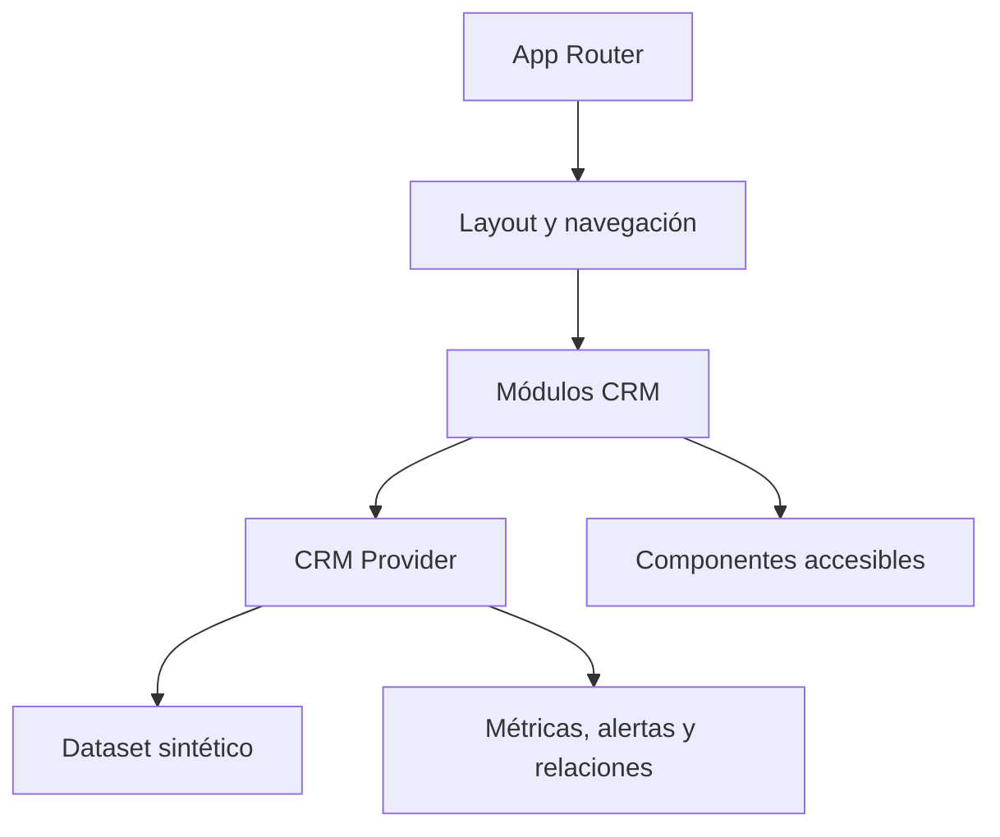

# Frontalini CRM — demo operativa

CRM inmobiliario de portfolio construido para explorar una interfaz de gestión completa: pipeline de leads, inventario de propiedades, demandas, agenda, alertas y métricas derivadas. Todos los registros son sintéticos y el estado vive únicamente en el navegador.

> **Alcance:** es una demo frontend sin autenticación, base de datos, API ni multiusuario. Al recargar se restablece el dataset inicial. No debe utilizarse con datos personales o comerciales reales.

## Problema y enfoque

El dominio inmobiliario combina entidades relacionadas y tareas con distinto horizonte temporal. La aplicación modela esas relaciones en un contexto tipado y ofrece una vista consistente para:

- registrar y mover leads por etapas;
- administrar propiedades y sus retasaciones;
- asociar demandas con oportunidades;
- visualizar eventos, recordatorios y alertas;
- derivar indicadores comerciales desde el estado actual;
- recorrer búsquedas, filtros y formularios responsive.

## Stack

- Next.js 16 con App Router
- React 19 y TypeScript
- Tailwind CSS 3
- Radix UI y componentes propios
- Recharts para visualizaciones
- React Hook Form y Zod en la capa de formularios

## Arquitectura



El proveedor CRM es la única fuente de verdad durante la sesión. Las operaciones actualizan entidades relacionadas de forma inmutable; por ejemplo, editar un evento conserva la sincronización con el lead asociado. El proyecto no simula una API ni afirma persistencia inexistente.

## Ejecutar localmente

Requiere Node.js `>=20.9 <23` y pnpm 9.

```bash
corepack enable
pnpm install --frozen-lockfile
pnpm dev
```

Verificación:

```bash
pnpm lint
pnpm build
pnpm audit
```

No se requieren variables de entorno.

## Seguridad y datos

- datos iniciales claramente sintéticos: nombres “Lead Demo”, teléfonos no operativos y códigos `DEMO-...`;
- banner persistente que explica el alcance;
- validación de tipos habilitada durante el build;
- carga local limitada a cinco imágenes JPG, PNG o WebP de hasta 5 MB cada una;
- sin cookies, analytics, credenciales ni transporte de red propio;
- dependencias auditadas y overrides acotados para versiones corregidas de paquetes transitivos.

## Limitaciones conocidas

- no hay sesiones, roles, autorización ni persistencia;
- varias acciones son representaciones de UI, no procesos de negocio completos;
- los adjuntos se convierten en data URLs y solo deberían usarse con archivos de prueba;
- las métricas describen el dataset sintético, no resultados comerciales;
- no existe suite automatizada; se ejecutan lint estricto, chequeo de tipos durante build y auditoría de dependencias.

## Estructura

```text
app/          rutas, layout y páginas
components/   módulos de leads, propiedades, agenda y UI
lib/          contexto, store sintético, tipos y utilidades
public/       recursos estáticos
```

## Estado de demo

No hay un deployment público verificado. La forma reproducible de evaluación es la ejecución local.

## Autor

Desarrollado por [Nicolás De Felippe](https://github.com/nicodf91) como proyecto de portfolio.
